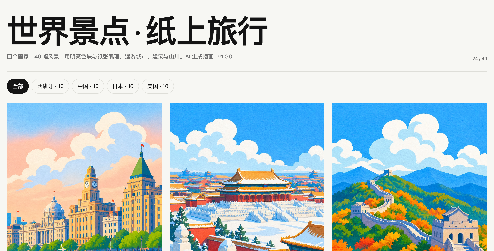

# 世界景点 · 纸上旅行 / World Landmarks

西班牙、中国、日本、美国各 10 张景点插画，共 40 张。以平涂色块与纸张肌理表现城市、建筑和自然风景，支持国家筛选、高清预览、键盘切换、下载与分享。图片由内置 imagegen 及三个国家 subagent 生成；场景为艺术化表达。

40 original gouache illustrations, ten each from Spain, China, Japan and the USA. Filter by country, explore a keyboard-accessible lightbox, and download high-resolution images. AI-generated artwork, not precise geographic documentation.



- [Live gallery](https://world-landmarks.xiaosang.cc/)
- [GitHub Repo](https://github.com/holynova/world-landmarks)
- [Artwork notes and official references](https://world-landmarks.xiaosang.cc/about.html)
- [Original PNG packs](https://github.com/holynova/world-landmarks/releases/tag/v1.0.0)


## Run locally

```bash
npm ci
cp .env.example .env
npm run dev
```

## Build and deploy

```bash
npm run check
npm test
npm run build
npm run deploy:check
npm run deploy
```

Cloudflare Workers Static Assets, exact host route and proxied DNS for `world-landmarks.xiaosang.cc`. Source and deployment config use main; deploy manually from the same commit.

Original PNGs: `incoming/`. Full prompts and official landmark sources: `public/landmarks.json`. AVIF/WebP/JPEG derivatives are created at build time and original PNGs do not enter `dist/`. Gallery downloads are full-resolution JPEGs; lossless original PNG packs are attached to the release. v1.0.0.
